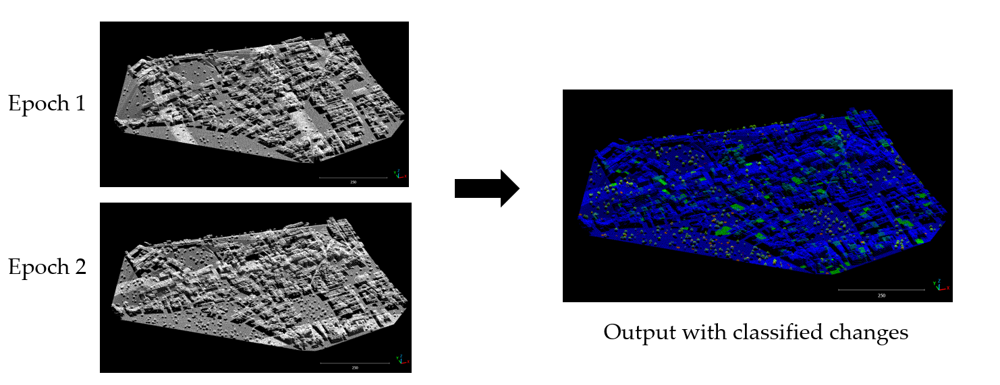

# Point-Cloud-Urban-Change-detection
Repository for detecting changes and classifying them in a point cloud dataset
WORK IN PROGESS....
ALL CODES ARE PRONE TO CHANGING
... STAY TUNED FOR MORE :D

1) [`media`](./media/): Images used in this repository.
1) [`Change_Detection_Scripts`](./Change_Detection_Scripts): Folder with the full scripts of the change detection methods.
2) [`Data_Pre-Processing_Script`](./Data_Pre-Processing_Script): Folder with the full scripts for the pre-processing of the data.
1) [`Dataset`](URB3DCD): A sample of pre-processed data from Urb3DCD dataset.
1) [`Requirements`](requirements.txt): The version of the libraries used in the code
